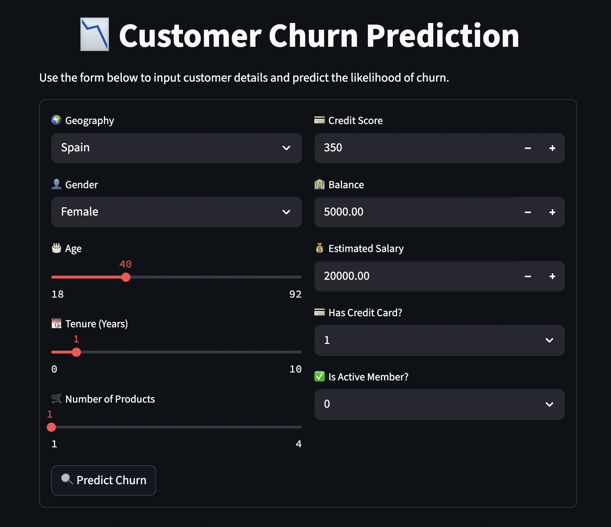
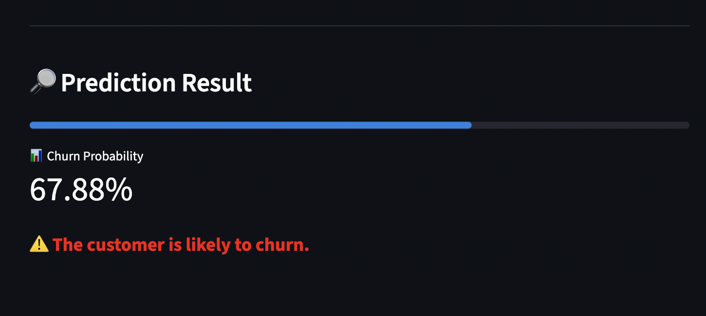

# End to End Deep Learning Project on Customer Churn Prediction

## Problem Statement

`Customer churn` is a critical business problem where companies lose clients or subscribers. Predicting which customers are likely to leave enables organizations to take proactive measures to retain them, improving profitability and customer satisfaction. This project addresses the challenge of predicting customer churn using historical data.

## Solution Overview

This project demonstrates an end-to-end workflow for building a customer churn prediction model using an Artificial Neural Network (ANN). The process includes data preprocessing, feature engineering, model training, and preparation for deployment.

## Approach

### 1. Data Preprocessing:  
   - Removal of irrelevant features (`RowNumber`, `CustomerId`, `Surname`).
   - Encoding categorical variables (`Gender`, `Geography`) using label encoding and one-hot encoding.
   - Feature scaling using `StandardScaler`.
   - Saving encoders and scalers for consistent inference.

### 2. Feature Engineering
- Transformed features to be suitable for ANN input.
- Ensured all preprocessing steps are reproducible and artifacts are stored in the `models/` directory.

### 3. Modeling with ANN:  
   - The processed data is used to train an Artificial Neural Network for binary classification (churn vs. no churn).
   - Using the `Keras` library, the ANN is built with:
     - Input layer
     - Hidden layers with `ReLU` activation
     - Output layer with `sigmoid` activation for binary classification
   - The model is compiled with `binary_crossentropy` loss and `adam` optimizer.
   - Early stopping is implemented to prevent overfitting by monitoring validation loss.
   - Used `TensorBoard` for visualizing training metrics.

### 4. Evaluation and Deployment:  
   - The model is evaluated on a hold-out test set.
   - Preprocessing artifacts are saved for use in production or further experimentation.
   - Deployed using `Streamlit` for a simple web interface to interact with the model.

---

## Project Structure

- `dataset/ChurnPrediction.csv`: Raw dataset.
- `requirements.txt`: Python dependencies.
- `feature_transformation.ipynb`: Data preprocessing and feature engineering notebook.
- `ann_implementation.ipynb`: ANN model training and evaluation notebook.
- `prediction.ipynb`: Notebook for making predictions using the trained model.
- `models/`: Serialized encoders and scalers.
- `app.py`: Streamlit application for model inference.

---

## Screenshots

